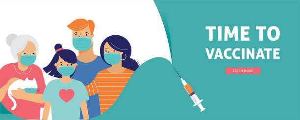
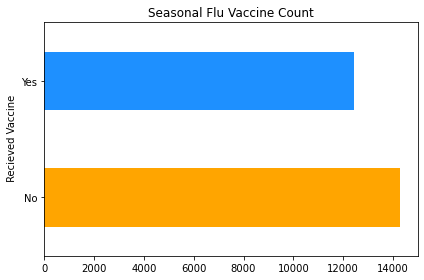
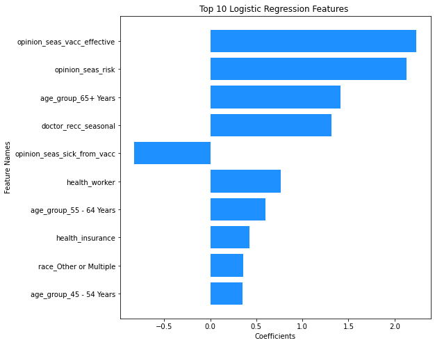
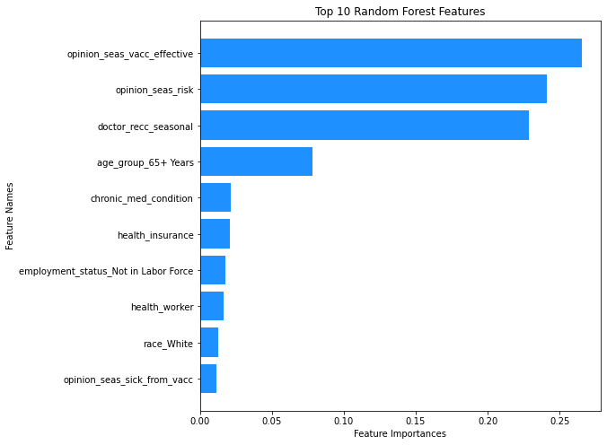
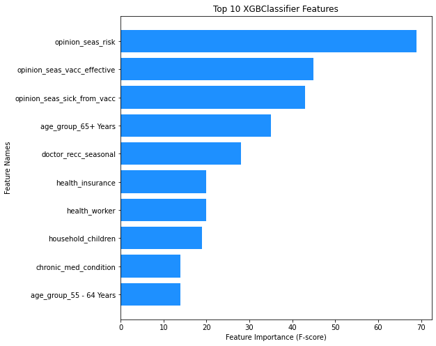
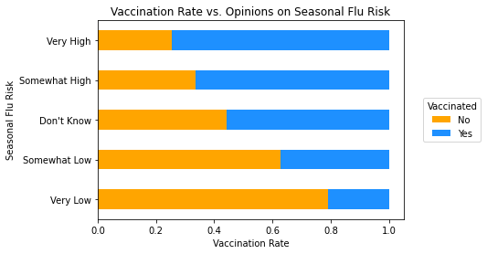
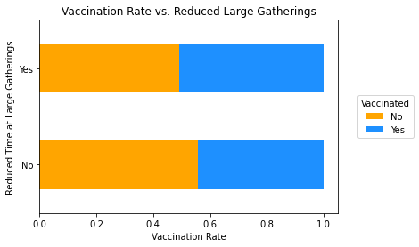
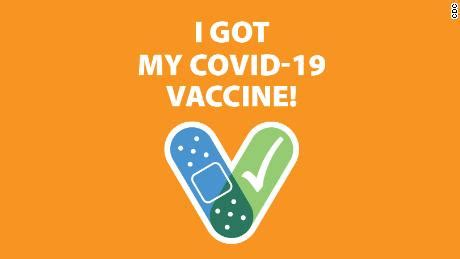

# Predicting Flu Vaccine Compliance: National 2009 H1N1 Flu Survey 

## Overview

In 2009 the CDC gathered information on vaccine compliance in the U.S. using the National 2009 H1N1 Flu Survey. The **CDC** now wants to pull out **useful features** along with any other insights from this data to inform the creation of **a new survey** about COVID-19 vaccine compliance. 

## Business and Data Understanding

### Business Problem
Create a model that best predicts who gets the seasonal flu vaccine, so we can find the features relevant to routine vaccine compliance.

### Data

#### Limitations of the Dataset
The data was collected via telephone surveys, a commonly used polling method which is not representative or random (as people choose to respond or not when they are called). Additionally, new surveys and models may need to take into account the anti-vaccine movement (article [here](https://pubmed.ncbi.nlm.nih.gov/16039769/)) which was not as prevalent when the data was collected in 2009, as well as the cultural and behavioral shifts that have occurred due Covid-19. Finally, this dataset has a large amount of missing responses that need to be dealt with in order to model the data. We will discuss this in depth later on in the notebook. 
#### Why We Used This Dataset
Despite the above limitations, the National 2009 H1N1 Flu Survey contains a large number of responses, takes into account a large number of features relevant to seasonal flu vaccine compliance, and is a relatively recent dataset. For all these reasons, we decided to use this dataset to create our predictive model. 
#### Dataset Size 
The initial dataset contained 26,707 responses with 36 questions. Only 27 questions were included in the analysis, as questions about the H1N1 vaccine or with responses containing identifying information were excluded. We chose to focus solely on seasonal flu vaccine compliance, as that the seasonal flu is a routine vaccine much like present-day COVID-19 vaccines

## Modeling

### Baseline Model


Above, we can see that around 47% of respondents were vaccinated, and around 53% were not. That means that if we were to guess the most common vaccination status (not vaccinated) everytime, we would be right 53% of the time. In order for our advanced models to be able to contribute anything meaningful about the data, we would have to be accurate more than 53% of the time. We decided to use accuracy as our metric as the data is fairly evenly split, and it's more intuitive than F1-scores. 

### Linear Regression Model


Because our outcome data is binary, we first tried using `LogisticRegression` to model our data.In our final logistic regression model, we got 78.09% accuracy- pretty good. We wanted to try out a few other models to see if we could improve both the accuracy and the balance of the graph features.

### Random Forests Model


Lets use a `RandomForestClassifier`, an ensemble method which uses an initial weakly fitted model which it builds on. This model type tends to  prevent overfitting and works well with non-linear data. In our final random forest model, we got 77.33% accuracy and the balance of our graph features is more skewed. It seems like our logistic regression model did better than the random forest model we built. We'll try one more model.

### Final Model:XGBoost Model 


XGBoost is an ensemble method that provides some of the best-in-class performance compared to other classification algorithms. In the final XGBoost model, we say 78.82% accuracy on the test data set. This was the highest accuracy we've seen so far. Additionally, the graph features seem much more balanced in this model. With those two metrics in mind, we decided that this is our final model. 

## Evaluation of Final Model
When we ran our holdout validation set, the XGBoost model gave us 78.47% accuracy - pretty decent all things considered! While the `GridSearchCV` used to optimize the final model took some time to run, the fitting and running of the model was fairly quick. Our original goal was to find the most relevant features so as to give recommendations for the creation of a new COVID-19 vaccine survey. The final model allows us to pull out the most relevant features and examine which ones we should use in COVID-19 vaccine compliance survey.

### Visualizations of Specific Features
We will take a quick glance at the best and worst feature according to our final model, in order to get a visual understanding of why some features performed better than others. 

#### Best Performing Feature


Here we see a clear correlation - the more concerned the respondents reported feeling, the more likely they were to report being vaccinated, and vice versa. 

#### Worst Performing Feature


Compared to the best performing feature, we can see why our model rated this one so poorly- while we can see a slight difference, it's much harder to find any discernible patterns. 

## Conclusion


### Reccomendations
Based on our final model, we see that questions about peoples **opinions** about vaccines was highly correlated to their **vaccination status**. As such, my first recommendation would be to include these types of questions (e.g. "How likely are you to get sick if you don't get the vaccine?", "How effective are vaccines, in your opinion?", "How concerned are you about getting sick from the vaccine?") in the survey. 

The second recommendation would be to ask for the respondents **age**, if their **health insurance** covers the vaccine (as everyone is now supposed to have health insurance in the U.S., unlike in 2009) and if their primary **doctor spoke to them** about getting the COVID-19 vaccine, as these questions were also shown in the model as relevant to vaccine compliance. 

The final recommendation is to try and **limit the number of questions included in the survey**, in order to encourage and enable complete survey responses. This dataset included lots of missing data. By shortening the questionnaire, response compliance may be increased. 

Additionally, We'd like to suggest that the poor performance of the behavioral questions (e.g. "Have you avoided large gatherings? "Have you worn a mask?") in the final model was perhaps due to the lack of public health messaging around these behaviors during the H1N1 outbreak. These types of behavioral recommendations were much more prevalent throughout the COVID-19 pandemic. Intuitively it makes sense that self-reports of these behaviors after COVID-19 are likely to follow the stated opinions of respondents about vaccines (if someone says they are worried about getting sick, then it is likely they will say they wear a mask and have been vaccinated) but this assumption should be further investigated.

### Possible Next Steps
- Check if KNN is a better way to handle the missing data.

- Look into behavioral questions feature importance in a post- COVID world.

- Create and test the new COVID-19 survey!

## Repository Structure

```
├── .ipynb_checkpoints/
├── Data
├── Images
├── Predicting Flu Vaccine Compliance.ipynb
├── README.md
├── notebook.pdf
├── presentation.pdf
└── requirements.txt
```
